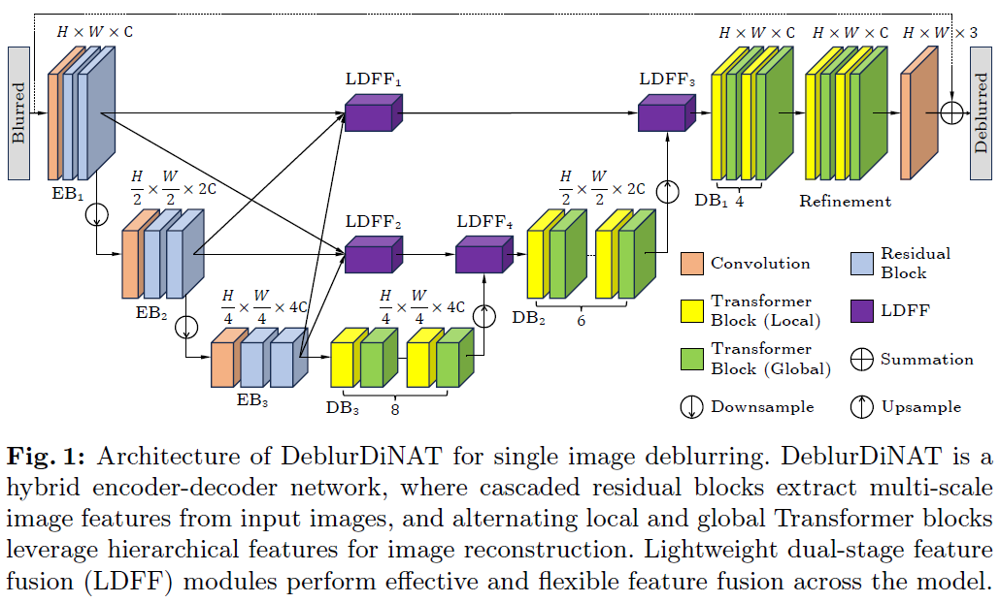

# DeblurDiNAT: A Generalizable Transformer for Perceptual Image Deblurring
<a href="https://arxiv.org/abs/2403.13163"></a> </br>

<a href='https://www.linkedin.com/in/hanzhouliu/'>Hanzhou Liu</a>, 
<a href='https://www.linkedin.com/in/binghanli/'>Binghan Li</a>, 
<a href='https://chengkai-liu.github.io/'>Chengkai Liu</a>,
<a href='https://cesg.tamu.edu/faculty/mi-lu/'>Mi Lu</a>


[](https://paperswithcode.com/sota/deblurring-on-realblur-j-trained-on-gopro?p=deblurdinat-a-lightweight-and-effective)
[](https://paperswithcode.com/sota/deblurring-on-realblur-r-trained-on-gopro?p=deblurdinat-a-lightweight-and-effective)
[](https://paperswithcode.com/sota/deblurring-on-hide-trained-on-gopro?p=deblurdinat-a-lightweight-and-effective)
[](https://paperswithcode.com/sota/deblurring-on-gopro?p=deblurdinat-a-lightweight-and-effective)

This is the Official Pytorch Implementation of DeblurDiNAT.




## Update:
* **2024.03.19** Release the initial version of codes for our DeblurDiNAT. 
* **2024.06.21** Improve the PSNR/SSIM scores and release the second version of codes for our DeblurDiNAT. 
* **2024.06.24** The updated preprint paper is available. 
* **2024.07.12** The updated preprint paper is available. 
* **2025.08.02** Extension work [DiNAT-IR](https://arxiv.org/abs/2507.17892), paper is available on arxiv.
* **2025.08.02** Extension work [DiNAT-IR](https://github.com/HanzhouLiu/DiNAT-IR), code has been released.

## Visual Results
| Blurry | DeblurDiNAT-L | FFTformer | Uformer-B | Stripformer | Restormer |
| --- | --- | --- | --- | --- | --- |
|  |  |  |  |  |  |
|  |  |  |  |  |  |
|  |  |  |  |  |  |
|  |  |  |  |  |  |

## Quantitative Results


## Installation
The implementation is modified from "[DeblurGANv2](https://github.com/VITA-Group/DeblurGANv2)".
```
git clone https://github.com/HanzhouLiu/DeblurDiNAT.git
cd DeblurDiNAT
conda create -n DeblurDiNAT python=3.8
conda activate DeblurDiNAT
conda install pytorch==2.0.0 torchvision==0.15.0 pytorch-cuda=11.8 -c pytorch -c nvidia
pip install cmake lit timm opencv-python tqdm pyyaml joblib glog scikit-image tensorboardX albumentations einops
pip install -U albumentations[imgaug]
pip install albumentations==1.1.0
pip3 install natten==0.14.6+torch200cu118 -f https://shi-labs.com/natten/wheels
pip install "numpy<2"
pip install timm==0.9.2
```
The Older Releases of NATTEN package is required. 
Please follow the NATTEN installation instructions "[NATTEN Homepage](https://shi-labs.com/natten/)".
Make sure Python, PyTorch, and CUDA versions are compatible with NATTEN.
If you installed the latest version, you may meet the unexpected key issue when loading pre-trained weights.

## Training
Download "[GoPro](https://drive.google.com/drive/folders/1BdV2l7A5MRXLWszGonMxR88eV27geb_n?usp=sharing)" dataset into './datasets'
for example: './datasets/GoPro'. Note: we say the blur images is A and the sharp images is B, e.g., ./GOPRO/test/sharp <-> .GOPRO/test/testB. </br>

Download "[VGG19 Pretrained Weights](https://drive.google.com/file/d/1r2_clZ02-ai6xM7EOHW9APqY9IxkPYsS/view?usp=drive_link)" into './models',
which is used to calculate ContrastLoss.  </br>

**We train our DeblurDiNAT in two stages:** </br>
* We pre-train DeblurDiNAT for 4000 epochs with patch size 256x256 </br> 
* Run the following command 
```
python train_DeblurDiNAT_pretrained.py
```

* After 4000 epochs, we keep training DeblurDiNAT for 2000 epochs with patch size 512x512 </br>
* Run the following command 
```
python train_DeblurDiNAT_gopro.py
```

## Testing
For reproducing our results on GoPro and HIDE datasets, download "[DeblurDiNATL.pth](https://drive.google.com/file/d/1VT7dpP550b83YZ0LjfmGA5t0nEA32EEs/view?usp=sharing)"

**For testing on GoPro dataset** </br>
* Download "[GoPro](https://drive.google.com/file/d/1Fp0MuEwFlzT_NKAFjr3SpuQl3Sm0cFYA/view?usp=sharing)" full dataset or test set into './datasets' (For example: './datasets/GoPro/test') </br>
* Run the following command
```
python predict_GoPro_test_results.py --job_name DeblurDiNATL --weight_name DeblurDiNATL.pth --blur_path ./datasets/GOPRO/test/testA
```
**For testing on HIDE dataset** </br>
* Download "[HIDE](https://drive.google.com/drive/folders/1BdV2l7A5MRXLWszGonMxR88eV27geb_n?usp=sharing)" into './datasets' </br>
* Run the following command
```
python predict_HIDE_results.py --job_name DeblurDiNATL --weight_name DeblurDiNATL.pth --blur_path ./datasets/HIDE/test/blur
```
**For testing on RealBlur test sets** </br>
* Download "[RealBlur_J](https://drive.google.com/drive/folders/1BdV2l7A5MRXLWszGonMxR88eV27geb_n?usp=sharing)" and "[RealBlur_R](https://drive.google.com/drive/folders/1BdV2l7A5MRXLWszGonMxR88eV27geb_n?usp=sharing)" into './datasets' </br>
* Run the following command
```
python predict_RealBlur_J_test_results.py --job_name DeblurDiNATL --weight_name DeblurDiNATL.pth --blur_path ./datasets/RealBlur_J/test/blur
```
```
python predict_RealBlur_R_test_results.py --job_name DeblurDiNATL --weight_name DeblurDiNATL.pth --blur_path ./datasets/RealBlur_R/test/blur
```

## Citation
```
@misc{liu2024deblurdinat,
      title={DeblurDiNAT: A Lightweight and Effective Transformer for Image Deblurring}, 
      author={Hanzhou Liu and Binghan Li and Chengkai Liu and Mi Lu},
      year={2024},
      eprint={2403.13163},
      archivePrefix={arXiv},
      primaryClass={cs.CV}
}
```
